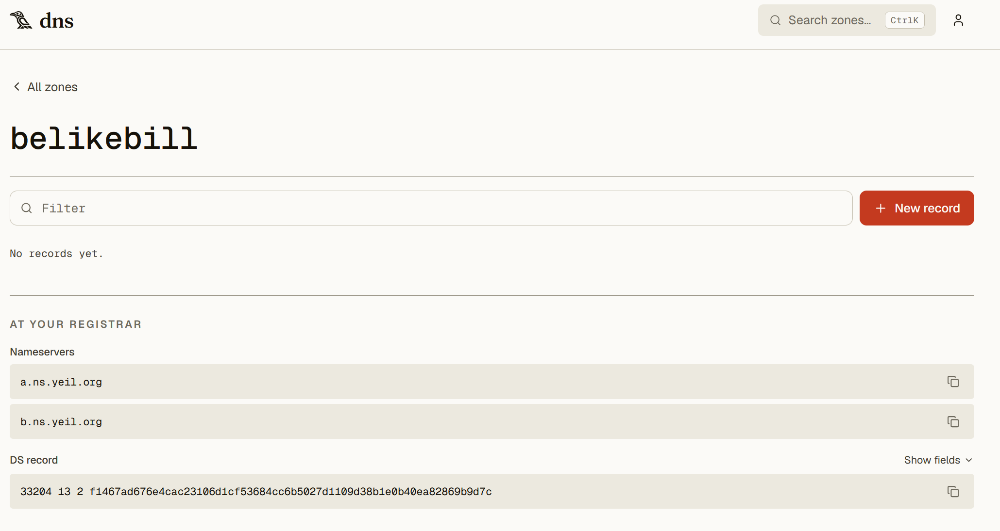
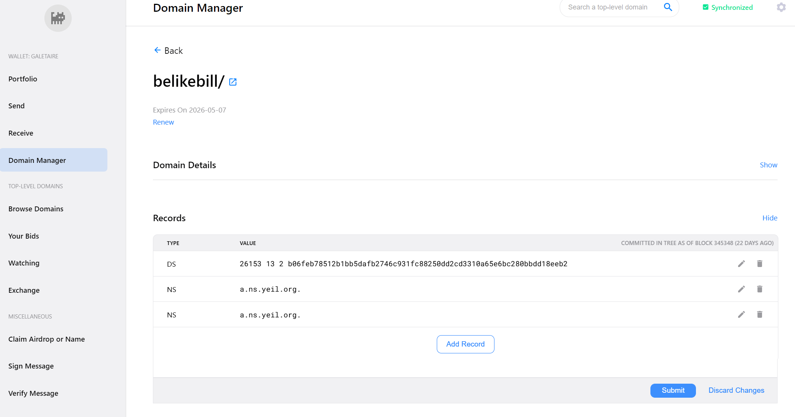
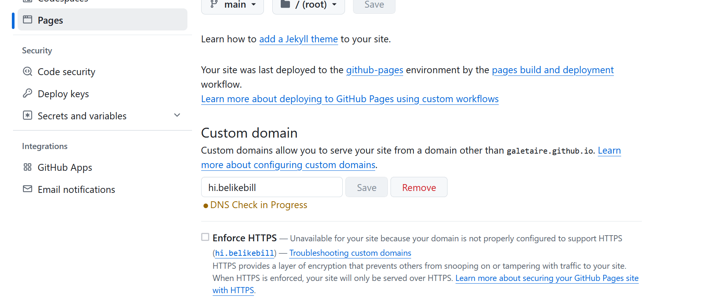
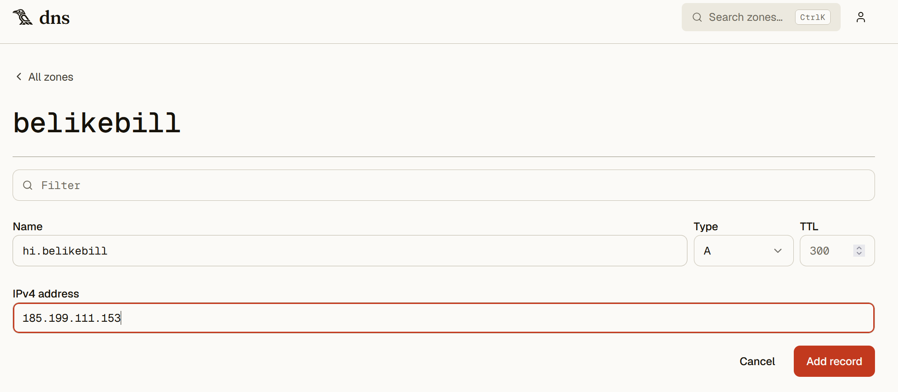

# How to Host a Website on a Handshake TLD

A brief guide to hosting a website on a self-controlled Handshake top-level domain (TLD). Handshake is an experimental DNS root zone based on a peer-to-peer (P2P) blockchain system.

> **Note:** This guide does not cover how to obtain a HNS domain names or coins, and it does not recommend crypto investment whatsoever. Skepticism around blockchain projects is more often right than wrong, but I consider HNS DNS to be a decent exception, as a healthy and valid alternative to ICANN DNS.

## What You Need

- [**Bob Wallet**](https://github.com/bob-wallet/bob-wallet/releases), with your top-level domain (TLD) and at least 10 HNS coins
- A [**Yeil DNS**](https://dns.yeil.app) account
- A **GitHub** account

## 1. Bob Wallet

You need a TLD stored in your personal Bob Wallet. You can bid for TLDs using Bob, which is both a node and a self-custodial wallet that lets you interact directly with the blockchain.

## 2. Yeil DNS Account

Yeil DNS is a service that lets you connect your self-custodied TLD in Bob Wallet to their DNS nameserver, so you can manage your domain records without losing custody of your TLD. At any time, you can use Bob Wallet to delete all records associating your TLD with Yeil, breaking the connection. Yeil is developed by https://eskimo.software.

## 3. Connect Your Domain: Bob Wallet <-> Yeil

You need to connect your TLD (in Bob Wallet) to Yeil DNS. In your Yeil account, go to **New zone**, type the TLD name you own, and click **Add**. Once created it will appear the records you need to add to your TLD in Bob Wallet in order to create the connection.



In Bob Wallet, go to **Domain Manager** and click your TLD to open a new screen. In the **Records** section, add the records provided by Yeil:

- **2 NS records** — for example, `a.ns.yeil.org`, add a point `.` at the end if encountering errors `b.ns.yeil.org.`
- **1 DS record** — using the value shown in your Yeil account



Click **Submit** to save the changes. Updating takes roughly 10–20 minutes (the time for each block to be minted). After that, you should be able to see the new records on any HNS explorer, such as https://shakeshift.com.

## 4. Configure GitHub

Create a **New repository**, give it a name of your choice, and click **Create**.

In your new repository, click **Add file → Create new file**. Name the file `index.html` and add some HTML content in the editor, for example:

```html
<h1>Hi, it's me!</h1>
```

Commit the changes.

Still on GitHub, open the **Settings** tab and scroll down to the **Pages** section. Set the source to the `main` branch and the `/ (root)` folder, then click **Save**. After about 5 minutes, refresh the Pages section, a message at the top will show that your site is live at a URL similar to:

```
https://youraccount.github.io/yourrepository
```

Visit the site. At this point, your website is online.

In the **Pages** section, go to **Custom domain** and add your desired domain. Note that it must be a second-level domain (e.g. `something.yourdomain`); GitHub will not recognize a pure HNS top-level domain:

```
hi.yourdomain
```

Because it is not an ICANN domain, GitHub will report that it doesn't work. Even though it will always show **"DNS Check in Progress,"** your site will still be online. It takes around 30 minutes to go live.



## 5. Set Your Domain: Yeil <-> GitHub

Finally, connect Yeil with GitHub. In your Yeil DNS zone, click **New record** for your domain and add an **A** record:

| Type | Name            | Content                                    |
| ---- | --------------- | ------------------------------------------ |
| A    | `hi.yourdomain` | `185.199.111.153` (a GitHub Pages IP)      |



The record update takes about 6 hours to go live. After that, your site will be online at your domain:

```
http://hi.yourdomain/
```
> **Note:** To resolve the Handshake DNS protocol, you will need a resolver, since browsers do not support it natively. Consider using [Fingertip](https://github.com/imperviousinc/fingertip).

## Done!

The next step is to personalize your website (right now it's just `index.html`). You can ask an AI to build a nicer one for you. The low cost of the HNS network lets you host an almost unlimited number of sites for next to nothing.
